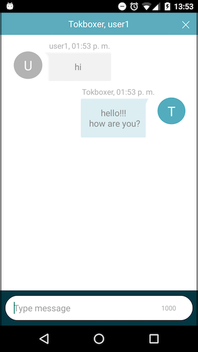
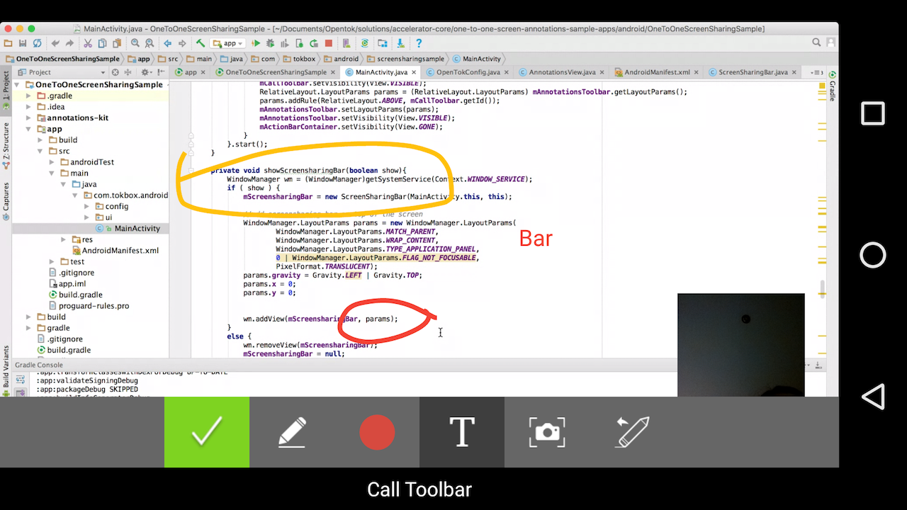

# Accelerator Core Android

[](https://travis-ci.org/opentok/accelerator-core-android) [](./README.md) [](./.github/LICENSE)


## Quickstart
The Accelerator Core Android library gives you an easy way to integrate [OpenTok SDK](https://tokbox.com) to any Android applications.

## Installation

- [Using the repository](#using-the-repository)
- [Using Maven](#using-maven)

### Using the repository

1. Clone the [accelerator core android repository](https://github.com/opentok/accelerator-core-android).
1. Start Android Studio and create a project.
1. From the project, right-click the app name and select > Module > Import Gradle Project.
1. Navigate to the directory in which you cloned **OpenTok Accelerator Core Android**, select **accelerator-core**, and click **Finish**.
1. Open the **build.gradle** file for the app and ensure the following lines have been added to the `dependencies` section:

```gradle
implementation project(':accelerator-core-android')

```

### Using Maven

Download it from http://tokbox.bintray.com/maven. For example:

a) Edit the build.gradle for your project and add the following code snippet to the all projects/repositories section:

```gradle
maven { 
  url  "http://tokbox.bintray.com/maven" 
}
```

b) Modify build.gradle for your module and add the following code snippet to the dependencies section:

```gradle
implementation 'com.opentok.android:opentok-accelerator-core:x.y.z’
```

## Accelerator Core

### Exploring the Code

For detail about the APIs used to develop this library, see the [OpenTok Android SDK Reference](https://tokbox.com/developer/sdks/android/reference/) and [Android API Reference](http://developer.android.com/reference/packages.html).

| Class                   | Description                                                                                                                                                                    |
| ----------------------- | ------------------------------------------------------------------------------------------------------------------------------------------------------------------------------ |
| `OTAcceleratorSession`  | Manages the session, allows multiple listeners and implements a signaling protocol.                                                                                            |
| `OTWrapper`             | Represents an OpenTok object to enable a video communication.                                                                                                                  |
| `OTConfig`              | Defines the OpenTok Configuration to be used in the communication. It includes SessionId, Token and APIKey, and features like to subscribe automatically or subscribe to self. |
| `PreviewConfig`         | Defines the configuration of the local preview.                                                                                                                                |
| `BasicListener`         | Monitors basic state changes in the OpenTok communication.                                                                                                                     |
| `AdvancedListener`      | Monitors advanced state changes in the OpenTok communication.                                                                                                                  |
| `SignalListener`        | Monitors a signal received in the OpenTok communication.                                                                                                                       |
| `MediaType`             | Defines the Audio and Video media type.                                                                                                                                        |
| `StreamStatus`          | Defines the current status of the Stream properties.                                                                                                                           |
| `VideoScale`            | Defines the FIT and FILL modes setting for the renderer.                                                                                                                       |
| `ScreenSharingCapturer` | Custom screen sharing capturer. In the absence of a custom or default camera capturer, `Core Android` will generate one using the full screen as the capturer.                 |
| `ScreenSharingFragment` | Headless fragment used to implement the screensharing feature by default.                                                                                                      |

### Using Accelerator Core Android

You can start testing a basic multiparty application using the Accelerator Core with best-practices for Android.
 - [OpenTok Accelerator Sample Application](https://github.com/opentok/accelerator-sample-apps-android).

### Initialization

The first step in using the OTWrapper is to initialize it by calling the constructor with the OpenTokConfig parameter.

```kotlin
OTConfig config = OTConfig.OTConfigBuilder(SESSION_ID, TOKEN, API_KEY)
  .name("core-sample")
  .subscribeAutomatically(true)
  .subscribeToSelf(false)
  .build();

OTWrapper wrapper = OTWrapper(this, config);
```

### Obtaining OpenTok Credentials

To use OpenTok's framework you need a Session ID, Token, and API Key you can get these values at the [OpenTok Developer Dashboard](https://dashboard.tokbox.com/). For production deployment, you must generate the Session ID and Token values using one of the [OpenTok Server SDKs](https://tokbox.com/developer/sdks/server/).


### Set and define listeners

```kotlin

wrapper.addBasicListener(mBasicListener);
wrapper.addAdvancedListener(mAdvancedListener);

....
val basicListener = PausableBasicListener<OTWrapper>(object : BasicListener<OTWrapper> {
  //...
});

val advancedListener = PausableAdvancedListener<OTWrapper>(object : AdvancedListener<OTWrapper> {
  //...
});
```

### Connect and disconnect from an OpenTok session

Call to connect or disconnect from an OpenTok session. When the OTWrapper is connected, the BasicListener.onConnected(...) event is called.
If the OTWrapper failed to connect, the BasicListener.onError(...) event is called.

```kotlin

wrapper.connect();

//.....

wrapper.disconnect();

```

Each time a participant connects to the same session, the `BasicListener.onConnected(...)` event is called.
This event offers the information about the connection id of the participant who connected, the total connections count in the session and the data of the connection.

To check if the connection is our own connection or not, use OTWrapper.getOwnConnId().

```kotlin
  val isConnected: Boolean = false;
  val remoteConnId: String;

  val basicListener = PausableBasicListener<OTWrapper>(object : BasicListener<OTWrapper> {

      override fun onConnected(otWrapper: OTWrapper, participantsCount: Int, connId: String, data: String) {
          Log.i(LOG_TAG, "Connected to the session. Number of participants: $participantsCount, connId: $connId")

          if (wrapper.ownConnId == connId) {
              isConnected = true;
          }
          else {
              remoteConnId = connId;
          }
      }
    //....
});
```

### Start and stop preview

Call to start and stop displaying the camera's video in the Preview's view before it starts streaming video. Therefore, the other participants are not going to receive this video stream.

```kotlin
val previewConfig = PreviewConfig.PreviewConfigBuilder()
                        .name("Tokboxer")
                        .build()

wrapper.startPreview(previewConfig);
//.....
wrapper.stopPreview();
```

When the OTWrapper started the preview, the `BasicListener.onPreviewViewReady(...)` event is called. And when the OTWrapper stopped the preview, the BasicListener.onPreviewViewDestroyed(...) event is called.

```kotlin
val basicListener = PausableBasicListener<OTWrapper>(object : BasicListener<OTWrapper> {

    override fun onPreviewViewReady(otWrapper: OTWrapper, localView: View) {
      Log.i(LOG_TAG, "Local preview view is ready")
    }
    override fun onPreviewViewDestroyed(otWrapper: OTWrapper) {
      Log.i(LOG_TAG, "Local preview view is destroyed")
    }
});
```

### Start and stop publishing media

Call to start and stop the local streaming video. The source of the stream can be the camera or the screen. To indicate the screen source, it is necessary to set the screen-sharing parameter to TRUE.

```kotlin
val config: PreviewConfig;

//camera streaming
config = PreviewConfig.PreviewConfigBuilder()
                      .name("Tokboxer")
                      .build();

wrapper.startPublishingMedia(config, false);

//or screen streaming, using a custom screen capturer
config = PreviewConfig.PreviewConfigBuilder().
                  name("screenPublisher")
                  .capturer(screenCapturer)
                  .build();

wrapper.startSharingMedia(config, true);

```

When the OTWrapper started the publishing media, the `BasicListener.onStartedPublishingMedia(...)` event is called. And when the OTWrapper stopped the publishing media, the BasicListener.onStoppedPublishingMedia(...) event is called.

```kotlin
val basicListener = PausableBasicListener<OTWrapper>(object : BasicListener<OTWrapper> {

  override fun onStartedPublishingMedia(otWrapper: OTWrapper, screenSharing: Boolean) {
    Log.i(LOG_TAG, "Local started streaming video.")
  }

  override fun onStoppedPublishingMedia(otWrapper: OTWrapper, screenSharing: Boolean) {
    Log.i(LOG_TAG, "Local stopped streaming video.")
  }
});
```

### Remote participants management

To subscribe automatically to a participant connected to the session, the `subscribeAutomatically` property in the OTConfig has to be TRUE.
Then, when a remote participant connected to the session, the BasicListener.onRemoteJoined(...) event is called. And the BasicListener.onRemoteLeft(...) event is called. These callbacks contain the identifier for the remote participant, which is equals to the stream id of them.

```kotlin
val basicListener = PausableBasicListener<OTWrapper>(object : BasicListener<OTWrapper> {
   override fun onRemoteJoined(otWrapper: OTWrapper, remoteId: String) {
      Log.i(LOG_TAG, "A remote joined.")
    }

    override fun onRemoteLeft(otWrapper: OTWrapper, remoteId: String) {
      Log.i(LOG_TAG, "A remote left.")
    }
});
```

When the remote participant view is ready, the `BasicListener.onRemoteViewReady(...)` event is called. And when the remote participant view is destroyed, the BasicListener.onRemoteViewDestroyed(....) event is called.

```kotlin
val basicListener = PausableBasicListener<OTWrapper>(object : BasicListener<OTWrapper> {

  override fun onRemoteViewReady(otWrapper: OTWrapper, remoteView: View, remoteId: String, data: String) {
    Log.i(LOG_TAG, "Participant remote view is ready")
  }

  override fun onPreviewViewDestroyed(otWrapper: OTWrapper) {
    Log.i(LOG_TAG, "Local preview view is destroyed")
  });
```

### Pause and resume communication

Call these methods when the app's activity pauses or resumes. These pause or resume the video for the local preview and remotes.
The Accelerator Core offers the possibility to resume the events setting the `resumeEvents` parameter to TRUE in the `resume` method.

```kotlin
wrapper.pause();

//.....

wrapper.resume(true);  
```

### Connections management

The Accelerator Core offers a set of methods to manage the connections of the session.

```kotlin
//get our own connection Id
wrapper.ownConnId

//get the total connections in the session
wrapper.connectionsCount

//check if the own connection is the oldest in the current session
wrapper.isTheOldestConnection;

//compare the connections creation times between the local connection and the argument passing
int older = wrapper.compareConnectionsTimes(remoteConnId);

```

### Enable and disable the publishing and receiving media

To enable or disable the publishing audio or video.

```kotlin
//check the current status of the publishing video
wrapper.isPublishingMediaEnabled(MediaType.Video);

//check the current status of the publishing audio
wrapper.isPublishingMediaEnabled(MediaType.Audio);

//enable the video
wrapper.enablePublishingMedia(MediaType.Video, true);

//disable the audio
wrapper.enablePublishingMedia(MediaType.Audio, false);

```

### Get stream status

The status of a stream includes the media status, the stream type, the status of the media containers and the stream dimensions.

```kotlin
//to get the publishing stream status
wrapper.getPublishingStreamStatus();

//to get the remote stream status
wrapper.getRemoteStremStatus(remoteId);

```

### Signals Management

The Accelerator Core includes a complete Signaling protocol to register a signal listener for a given type.

```kotlin
wrapper.addSignalListener(SIGNAL_TYPE, this);

//send a signal to all the participants
wrapper.sendSignal(SignalInfo(wrapper.ownConnId, null, SIGNAL_TYPE, "hello"));

//send a signal to a specific participant, using the participant connection id.
wrapper.sendSignal(SignalInfo(wrapper.ownConnId, participantConnId, SIGNAL_TYPE, "hello"));

//manage the received signals. All the received signals will be of the registered type: SIGNAL_TYPE
public void onSignalReceived(signalInfo: SignalInfo, isSelfSignal: Boolean) { }
```

### Customize capturer and renderers

A custom video capturer or renderer can be used in the OpenTok communication for the publishing media.

```kotlin
val myCustomRenderer = CustomRenderer(...);
val myCustomCapturer = CustomCapturer(...);

val config = PreviewConfig.PreviewConfigBuilder().
                  name("screenPublisher").capturer(myCustomCapturer).renderer(myCustomRenderer).build();

wrapper.startPublishingMedia(config, false);
```

A custom video renderer can be used in the OpenTok communication for the received media. Please note, this should be set before to start the communication.

```kotlin
val myCustomRenderer = CustomRenderer(...);

//set a custom renderer dor the received video stream
wrapper.setRemoteVideoRenderer(myCustomRenderer);

//or set a custom renderer for the received screen stream
wrapper.setRemoteScreenRenderer(myCustomRenderer);
```

### Set Video Renderer styles

The video scale mode can be modified to FILL or FIT value for the publishing video or for the received video from the remotes.

```kotlin
wrapper.setPublishingStyle(VideoScalse.FIT);
wrapper.setRemoteStyle(remoteId, VideoScale.FILL);
```

### Cycle the camera

Cycle between cameras, if there are multiple cameras on the device. Then, the AdvancedListener.onCameraChanged(...) event is called.

```kotlin
wrapper.cycleCamera();
```

### Screen-sharing

According to [start and stop publishing media](#start-and-stop-publishing-media), you can start screensharing using OTWrapper

```kotlin
wrapper.startPublishingMedia(PreviewConfig.PreviewConfigBuilder()
                       .name("Tokboxer")
                       .build(), true);
```

Scree-sharing with a customer capturer can be achieved using:

```kotlin
val previewConfig = PreviewConfig.PreviewConfigBuilder()
                       .name("Tokboxer")
                       .capturer(myCapturer)
                       .build()

wrapper.startPublishingMedia(previewConfig, true);
```

### Using OTAcceleratorSession

The Accelerator Core library uses the `OTAcceleratorSession` to manage the OpenTok Session. This class lets you have several Session listeners and manage the signalling in the lib.

In the case, you don't need the audio/video communication, you can start by creating an OTAcceleratorSession instance, an apiKey and sessionID are requires. For more visit [Obtaining OpenTok Credentials](obtaining-pentok-redentials)

```kotlin
OTAcceleratorSession session = OTAcceleratorSession(context, apikey, sessionId);
session.addSignalListener("CHAT", this);

//send a signal
val messageObj = JSONObject();
messageObj.put("sender", "Tokbox");
messageObj.put("text", "hi!");
messageObj.put("sentOn", System.currentTimeMillis());

session.sendSignal(SignalInfo(mSession.getConnection().getConnectionId(), null, "CHAT", messageObj.toString()), null);
```

To get the OTAcceleratorSession instance used in the audio/video communication, call to:

```kotlin
OTAcceleratorSession session = wrapper.session;
```

## Accelerator TextChat



###  Exploring the code

The `TextChatFragment` class is the backbone of the text chat communication feature.

This class, which inherits from the [`androidx.fragment.app.Fragment`](https://developer.android.com/reference/androidx/fragment/app/Fragment) class, sets up the text chat UI views and events, sets up session listeners, and defines a listener interface to monitor the changes.

```java
public class TextChatFragment extends Fragment implements SignalListener {
    . . .
}
```

The `TextChatListener` interface monitors state changes in the `TextChatFragment`, and defines the following methods:

```java
public interface TextChatListener {
  void onNewSentMessage(ChatMessage message);
  void onNewReceivedMessage(ChatMessage message);
  void onTextChatError(String error);
  void onClose();
}

### Initialization methods

The following `TextChatFragment` methods are used to initialize the app and provide basic information determining the behavior of the text chat functionality.

| Feature                                           | Methods              |
| ------------------------------------------------- | -------------------- |
| Set the maximum chat text length.                 | `setMaxTextLength()` |
| Set the sender alias of the outgoing messages.    | `setSenderAlias()`   |
| Set the listener object to monitor state changes. | `setListener()`      |


For example, the following private method instantiates a `TextChatFragment` object:

```java
  OTAcceleratorSession mSession = new OTAcceleratorSession (context, apikey, sessionId);
  mSession.connect(token);

  //...

  private void initTextChatFragment() {
    mTextChatFragment = TextChatFragment.newInstance(mSession, apikey);
    getSupportFragmentManager().beginTransaction()
                .add(R.id.textchat_fragment_container, mTextChatFragment).commit();
    getSupportFragmentManager().executePendingTransactions();    
  }
```

This lines of code illustrates how to set the maximum message length to 1050 characters and set a new sender alias:

```java
  try {
    mTextChatFragment.setSenderAlias("Tokboxer");
    mTextChatFragment.setMaxTextLength(140);
    mTextChatFragment.setListener(this);
  } catch (Exception e) {
    e.printStackTrace();
  }
```

### Sending and receiving messages

By implementing the `TextChatFragment.TextChatListener` interface, the app can monitor both receiving and sending activity. For example, a message is successfully sent, or a message is sent with a code in the event of an error.

The method implementations shown below use the `ChatMessage` object to send and receive messages.

The `onNewSentMessage()` event is fired when a new individual `ChatMessage` is sent to other client connected to the OpenTok session. To send a `ChatMessage`, the `TextChatFragment` uses the [OpenTok signaling API](https://tokbox.com/developer/sdks/android/reference/com/opentok/android/Session.html#sendSignal(java.lang.String,%20java.lang.String)).

The `onNewReceivedMessage()` event is fired when a new `ChatMessage` is received from the other client.

```java
    @Override
    public void onNewSentMessage(ChatMessage message) {
        Log.i(LOG_TAG, "New sent message");
    }

    @Override
    public void onNewReceivedMessage(ChatMessage message) {
        Log.i(LOG_TAG, "New received message");
    }
```

## Accelerator Annotations



### Exploring the code

For detail about the APIs used to develop this accelerator pack, see the [OpenTok Android SDK Reference](https://tokbox.com/developer/sdks/android/reference/) and [Android API Reference](http://developer.android.com/reference/packages.html).

_**NOTE:** The project contains logic used for logging. This is used to submit anonymous usage data for internal TokBox purposes only. We request that you do not modify or remove any logging code in your use of this accelerator pack._

### Class design

| Class                      | Description                                                                                                                                                                                                                                                                                                                                 |
| -------------------------- | ------------------------------------------------------------------------------------------------------------------------------------------------------------------------------------------------------------------------------------------------------------------------------------------------------------------------------------------- |
| `AnnotationsToolbar`       | Provides the initializers and methods for the annotation toolbar view, and initializes functionality such as text annotations, a screen capture button, an erase button that removes the last annotation that was added, a color selector for drawing strokes and text annotations, and controls scrolling. You can customize this toolbar. |
| `AnnotationsView`          | Provides the rectangular area on the screen which is responsible for drawing annotations and event handling.                                                                                                                                                                                                                                |
| `AnnotationsListener`      | Monitors state changes in the Annotations component. For example, a new event would occur when a screen capture is ready or there is an error.                                                                                                                                                                                              |
| `AnnotationsPath`          | Extends the [Android Path class](https://developer.android.com/reference/android/graphics/Path.html), and defines the various geometric paths to be drawn in the `AnnotationView` canvas.                                                                                                                                                   |
| `AnnotationText`           | Defines the text labels to be drawn in the `AnnotationViewCanvas`.                                                                                                                                                                                                                                                                          |
| `Annotatable`              | Each `AnnotationText` or `AnnotationPath` is defined as an annotatable object.                                                                                                                                                                                                                                                              |
| `AnnotationsManager`       | Manages the set of the annotations in the annotations view.                                                                                                                                                                                                                                                                                 |
| `AnnotationsVideoRenderer` | Extends the [BaseVideoRenderer](https://tokbox.com/developer/sdks/android/reference/com/opentok/android/BaseVideoRenderer.html) class in the OpenTok Android SDK, and includes screenshot functionality.                                                                                                                                    |

**NOTE:** Scrolling is frozen while the user adds annotations. Scrolling is re-enabled after the user clicks **Done**, and the annotations are removed at that point.

### Using the Accelerator Annotation

#### Add the annotation toolbar

Add the `AnnotationsToolbar` to your layout:</p>

```java
<com.tokbox.android.annotations.AnnotationsToolbar
    android:id="@+id/annotations_bar"
    android:layout_width="match_parent"
    android:layout_height="wrap_content"
    android:layout_gravity="bottom"/>
```

The `AnnotationsToolbar` offers the following actions:

- _Freehand Annotation_: Handwritten annotation
- _Text Annotation_: Text label annotations.
- _Color Picker_: Select a color for the annotation.
- _Erase_: Delete the most recent annotation.
- _Screen Capture_: Take a screenshot of the annotations.
- _Done_: Clear all annotations and re-enabling scrolling.

#### Add a custom annotation renderer

If you would like to create a new instance of the `AnnotationsVideoRenderer` class or a new custom video renderer, for example, to manage the screen capture option in the annotations toolbar, start with this line of code:

```java
AnnotationsVideoRenderer mRenderer = new AnnotationsVideoRenderer(this);
```

#### Attach the annotation canvas to a view

You can attach an annotation canvas to a publisher view, for example, to the screen sharing view:

```java
try {
  AnnotationsView mScreenAnnotationsView = new AnnotationsView(this, mWrapper.getSession(), OpenTokConfig.API_KEY, true);

  mScreenAnnotationsView.attachToolbar(mAnnotationsToolbar);
  mScreenAnnotationsView.setVideoRenderer(mScreensharingRenderer);
  mScreenAnnotationsView.setAnnotationsListener(this);
  ((ViewGroup) mScreenSharingView).addView(mScreenAnnotationsView);
} catch (Exception e) {
  Log.i(LOG_TAG, "Exception - add annotations view " + e);
}
```

Or to a subscriber view:

```java
try {
  AnnotationsView mRemoteAnnotationsView = new AnnotationsView(this, mWrapper.getSession(), OpenTokConfig.API_KEY, mRemoteConnId);
  mRemoteAnnotationsView.setVideoRenderer(mRemoteRenderer);
  mRemoteAnnotationsView.attachToolbar(mAnnotationsToolbar);
  mRemoteAnnotationsView.setAnnotationsListener(this);
  ((ViewGroup) mRemoteViewContainer).addView(mRemoteAnnotationsView);
} catch (Exception e) {
  Log.i(LOG_TAG, "Exception - add annotations view " + e);
}
```

#### Implement an annotations listener class

To listen for annotation events, implement an `AnnotationsListener`:

```java
public  interface AnnotationsListener {
  void onScreencaptureReady(Bitmap bmp);
  void onAnnotationsSelected(AnnotationsView.Mode mode);
  void onAnnotationsDone();
  void onError(String error);
}
```

```java
public class MainActivity
    extends AppCompatActivity
    implements AnnotationsView.AnnotationsListener {

    @Override
    public void onScreencaptureReady(Bitmap bmp) {
        //A new screencapture is ready
    }

    @Override
    public void onAnnotationsSelected(AnnotationsView.Mode mode) {
        //An annotations item in the toolbar is selected
    }

    @Override
    public void onAnnotationsDone() {
        //The DONE button annotations item in the toolbar is selected. Scrolling is re-enabled.
    }

    @Override
    public void onError(String error) {
       //An error happens in the annotations
    }
  ...
}
```


## Development and Contributing

Interested in contributing? We :heart: pull requests! See the [Contribution](CONTRIBUTING.md) guidelines.

## Getting Help

We love to hear from you so if you have questions, comments or find a bug in the project, let us know! You can either:

- Open an issue on this repository
- See <https://support.tokbox.com/> for support options
- Tweet at us! We're [@VonageDev](https://twitter.com/VonageDev) on Twitter
- Or [join the Vonage Developer Community Slack](https://developer.nexmo.com/community/slack)

## Further Reading

- Check out the Developer Documentation at <https://tokbox.com/developer/>
